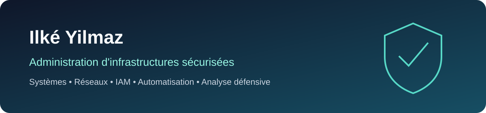

# Ilké Yilmaz

Administrateur d'infrastructures sécurisées, actuellement étudiant en **Mastère Management de la Cybersécurité à l'ISCOD pour l'année 2026-2027**. Je recherche une **alternance en cybersécurité** afin de consolider mes compétences en administration sécurisée, défense des systèmes, gestion des identités et analyse d'incidents.

## Objectif 2026-2027

Rejoindre une équipe informatique ou cybersécurité en alternance sur des missions telles que :

- administration et durcissement de systèmes Windows et Linux ;
- sécurité Active Directory, IAM et contrôle d'accès ;
- supervision, collecte de journaux et analyse d'incidents ;
- sécurité réseau, segmentation et diagnostic ;
- automatisation de contrôles avec PowerShell ou Ansible ;
- documentation, support et amélioration continue.

## Formation

- **2026-2027 — ISCOD** : Mastère Management de la Cybersécurité.
- **Titre professionnel Administrateur d'Infrastructures Sécurisées (AIS)** : certification RNCP de niveau 6.

## Compétences techniques

| Domaine | Compétences travaillées |
|---|---|
| Systèmes | Windows 10/11, Windows Server, virtualisation, support informatique |
| Identités | Active Directory, OU, groupes, GPO, IAM, moindre privilège, contrôle d'accès |
| Réseau | TCP/IP, IPv4, DNS, DHCP, VLAN, switching, routage, diagnostic |
| Sécurité | durcissement, journalisation, sauvegardes, analyse d'incidents, laboratoires défensifs |
| Automatisation | PowerShell, Ansible, exports CSV, contrôles reproductibles |

## Certifications

- **CompTIA Security+** — préparation en cours.
- **Microsoft SC-900** — certification visée.

## Projets

### Projets documentés

- [SecureTech MERIDIAN AIS](https://github.com/ilkey8752-bot/securetech-meridian-ais) — audit et sécurisation d'une infrastructure de laboratoire : segmentation, Active Directory, supervision et continuité.
- [InfraGuard Ansible](https://github.com/ilkey8752-bot/infraguard-ansible) — blueprint de durcissement Linux avec SSH, nftables, auditd, Restic et contrôle de syntaxe automatisé.

### Laboratoires en construction

- [Active Directory Security Lab](https://github.com/ilkey8752-bot/active-directory-security-lab) — architecture et recette d'un domaine Windows isolé.
- [Wazuh SIEM Lab](https://github.com/ilkey8752-bot/wazuh-siem-lab) — préparation documentée d'un laboratoire de collecte et de détection.
- [Network Analysis with Wireshark](https://github.com/ilkey8752-bot/network-analysis-wireshark) — scénarios d'analyse ARP, DNS, TCP, ICMP et HTTP/HTTPS.
- [PowerShell Security Scripts](https://github.com/ilkey8752-bot/powershell-security-scripts) — scripts défensifs d'inventaire et d'audit Windows.

Les résultats non encore obtenus sont identifiés par des mentions `TODO`. Les dépôts ne présentent pas comme validé ce qui n'a pas encore été testé en laboratoire.

## Contact

- [LinkedIn](https://www.linkedin.com/in/ilke-yilmaz-00a824292/)
- [ilkeyilmaz79@outlook.fr](mailto:ilkeyilmaz79@outlook.fr)

---

Ce profil documente une progression réelle en laboratoire. Aucun secret, mot de passe, export d'annuaire brut ou donnée sensible n'est publié.

